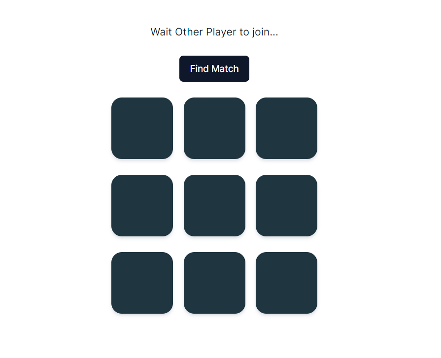
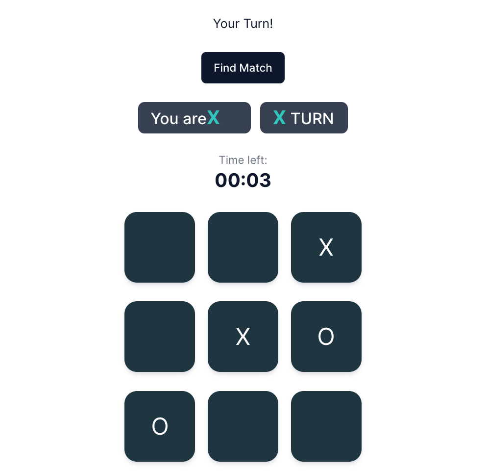

## 🧪 Demo Images




# 🎮 Nakama Real‑Time Multiplayer Game

A scalable real‑time multiplayer game built using **Nakama**, **TypeScript**, and **Docker**, supporting concurrent matches, matchmaking, and leaderboard tracking.


---

## 🚀 Project Overview

This project implements real‑time multiplayer matchmaking and gameplay using Nakama's server runtime with TypeScript. It includes:

* Real‑time game rooms (matches)
* Support for multiple concurrent games
* Leaderboards for wins, losses, and streaks
* Custom RPCs for match search and rewards

The example shown here represents a **Tic-Tac-Toe** game, but the structure supports extension to any turn‑based game.

---

## ✨ Features

### 🎮 Real‑Time Multiplayer Game Engine

* Turn‑based move system
* Match start/update/done events
* Server authoritative gameplay
* Input validation & rejection handling

### 🔀 Matchmaking

* Custom RPC `find_match_js`
* Automatic match creation & joining
* Supports fast or balanced matchmaking

### 🧩 Concurrent Game Support

* Completely isolated game instances
* Scalable to thousands of matches
* Game state stored per match


### 🎁 Daily Rewards System

* Included example: `daily_rewards.ts`
* Claim cooldown system
* Secure server-side logic

---

## 🏗️ Architecture

```
+------------------------------+
|          Client App          |
|            (Web ) 
+--------------+---------------+
               |
               | WebSocket & RPC
               v
+-------------------------------------------+
|                Nakama Server               |
|  - TypeScript Runtime Modules              |
|  - Matchmaker & Match Handler              |
|  - Leaderboards                            |
|  - Storage Engine                          |
+-------------------+-----------------------+
                    |
                    | Database
                    v
          +---------------------+
          |      PostgreSQL     |
          | Player Data, Stats  |
          +---------------------+
```

---

## 📁 Folder Structure

```
backend/
│── Dockerfile
│── package.json
│── tsconfig.json
│── data/
│     └── local.yml
│── src/
│     ├── match_handler.ts
│     ├── match_rpc.ts
│     ├── daily_rewards.ts
│     ├── types.ts
│     └── main.ts  (InitModule)
└── build/ (auto‑generated JS)
```

---

## 🛠️ Setup Instructions

### 1️⃣ Install Dependencies

Make sure you have:

* Node.js
* Docker
* Docker Compose

### 2️⃣ Install Node Modules

```
npm install
```

### 3️⃣ Build TypeScript

```
npx tsc
```

This outputs compiled `.js` files into `/build`.

### 4️⃣ Run Nakama Server With Your Module

```
docker-compose up --build
```

### 5️⃣ Logs

Look for:

```
JavaScript logic loaded.
```

Which means your module is registered.


## 🔧 Game Logic Explanation

### **Match Init**

Creates empty board, assigns marks (X/O), sets deadlines.

### **Match Join**

Player joins a room — match starts when enough players join.

### **Match Loop**

Runs every tick:

* checks timeout
* validates moves
* determines winner
* updates board
* broadcasts messages

### **Match Terminate**

Cleans game state when match ends.

### **RPC: find_match_js**

Allows clients to request a match.

### **RPC: rewards_js**

Processes daily rewards.

---

## 📌 Example TypeScript Runtime Registration

```ts
initializer.registerMatch(moduleName, {
  matchInit,
  matchJoinAttempt,
  matchJoin,
  matchLeave,
  matchLoop,
  matchTerminate,
  matchSignal
});

initializer.registerRpc("find_match_js", rpcFindMatch);
initializer.registerRpc("rewards_js", rpcReward);
```

---

## 🚀 Deployment

For production, update `local.yml` with:

* Database credentials
* Ports
* Socket SSL
* Console security

Then build:

```
docker build -t nakama-game .
docker run nakama-game
```


---

## 📫 Contact

pranavsonar2311@gmail.com
9156120635
